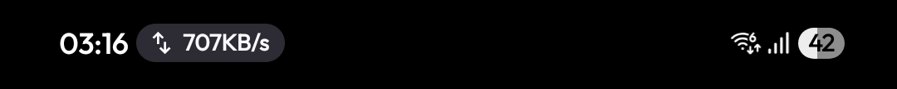
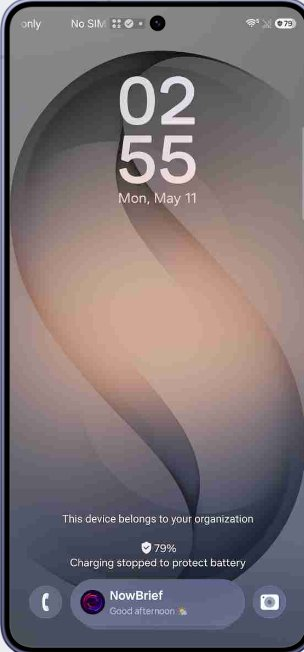
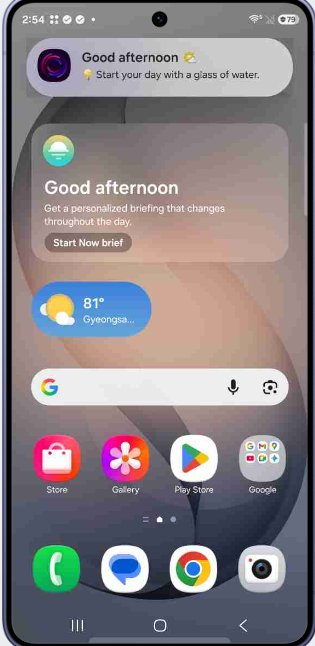
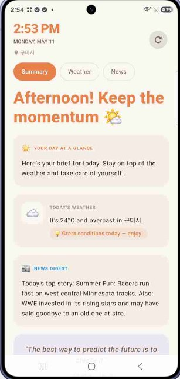
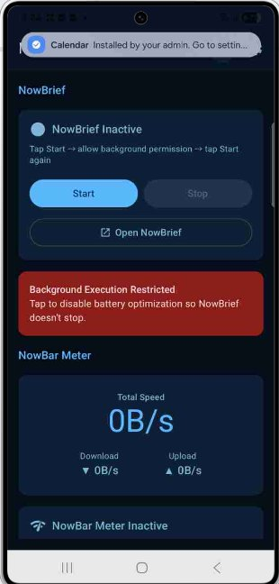
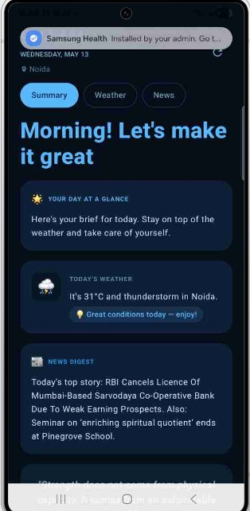

# NowBrief

<p align="center">
  
</p>

<p align="center">
  <strong>Your AI-powered daily brief. Live in the Samsung Now Bar.</strong>
</p>

<p align="center">
    <!-- CI updates this automatically from the git tag -->
  
  
  
  
</p>

---

## What is NowBrief?

NowBrief is an AI-powered daily brief that lives natively inside the **Samsung One UI Now Bar** — the live update pill in your status bar. Every morning (and throughout the day), it surfaces a personalised summary of your weather, top local news, rotating quotes, and a music recommendation — all generated by **Gemini 2.0 Flash**, tailored to your exact location and time of day.

It bypasses Samsung's whitelist restriction to inject itself into the Now Bar as a native, ongoing live activity — something only Samsung's own partner apps can do.

<div align="center">
  
  <p><em>NowBrief running as a native Now Bar live activity.</em></p>
</div>

<br/>

<div align="center">
  <table>
    <tr>
      <td align="center">
        
        <br/><sub><b>🔒 Lock Screen</b><br/>Live pill always visible</sub>
      </td>
      <td align="center">
        
        <br/><sub><b>🌤 Now Bar</b><br/>AI greeting + weather</sub>
      </td>
      <td align="center">
        
        <br/><sub><b>☀️ Day Mode — Brief</b><br/>Warm orange summary</sub>
      </td>
    </tr>
    <tr>
      <td align="center">
        
        <br/><sub><b>🌙 Night Mode — Main</b><br/>NowBrief + NowBar Meter</sub>
      </td>
      <td align="center">
        
        <br/><sub><b>🌊 Night Mode — Brief</b><br/>Indian news · ocean blue</sub>
      </td>
      <td align="center">
        
        <br/><sub><b>💊 Now Bar Pill</b><br/>Live in Samsung status bar</sub>
      </td>
    </tr>
  </table>
</div>

---

## ⚡ Quick Setup — Follow this exact order

> **Follow every step in sequence — order matters!**

### Step 1 — Install & open
1. [Download the latest APK](https://github.com/MukulBolt9/xz/releases/latest)
2. Install it (enable "Install from unknown sources" if asked)
3. Open **NowBrief**

### Step 2 — Start NowBrief → grant background permission
1. **Tap "Start"** in the **NowBrief** card (top card)
2. System opens the **"Display over other apps"** settings screen → find NowBrief → toggle **Allow**
3. Press Back to return to NowBrief

### Step 3 — Enable NowBar Meter → allow notifications
1. **Tap "Start NowBar Meter"** in the **NowBar Meter** card (bottom card)
2. A **notification permission** dialog appears → tap **Allow**

### Step 4 — Start NowBrief again
1. **Tap "Start"** in the **NowBrief** card (top card) **one more time**
2. ✅ The Now Bar pill appears in your Samsung status bar with a live AI greeting

---

> **Complete flow in one line:**  
> `Open app` → `Start (NowBrief)` → `Allow overlay` → `Start NowBar Meter` → `Allow notifications` → `Start (NowBrief) again` → **done ✅**

---

## What you'll see

| Location | Content |
|---|---|
| **Status bar pill** | Live time-specific greeting + rotates weather / tips / quote / music every 30s |
| **Lock screen** | Same live activity, visible without unlocking |
| **Summary tab** | Full AI brief: day overview, smart weather insight, news digest, vitals snapshot, quote, music |
| **Weather tab** | Insight banner at top · temp, humidity, UV, wind, rain chance, sunrise/sunset, AQI |
| **News tab** | Today's digest banner · live local headlines — auto-switches to your country |
| **Vitals tab** | Today's insight · steps, screen time, sleep tracking with rings |

---

## Features

### 🤖 AI Brief (Gemini 2.0 Flash)
- **Day at a Glance** — warm 2-sentence overview of your day
- **Smart Weather Insight** — multi-signal advice (heat, UV, rain, humidity, AQI, wind) shown in Summary and at the top of Weather tab
- **News Digest** — AI summary of today's top local headlines
- **100 Rotating Quotes** — shuffled pool, new every 5 minutes
- **Music Pick** — song matched to your mood and time → opens Spotify

### 🧠 Smart AI Search (No API Key)
- **DuckDuckGo Instant Answer** — direct facts, calculations, conversions, entity infoboxes
- **Wikipedia OpenSearch** — resolves your query to the exact canonical page title
- **Wikipedia REST Summary** — clean intro paragraph, trimmed to 2–3 readable sentences
- **Wikipedia Search API** — broader keyword fallback with HTML-stripped snippets
- **Live news matching** — always appends relevant today's headlines to any answer

### 💤 Smart Sleep Tracking
- **Onboarding wizard** — set your sleep goal (6–9h) and pre-sleep habits (DND, airplane mode, charger, etc.) on first launch; re-open anytime by tapping the sleep ring
- **Multi-signal detection** (like Samsung Health):
  - Screen-off window scan — finds longest overnight gap between 8 PM–4 AM, ignoring naps
  - Still sleeping detection — if screen hasn't come back on, shows live elapsed ticker
  - Persisted sessions — survives app kills mid-sleep via DataStore
  - History — saves each night's hours for future week-view
- **Live ring** — shows 🌙 + "2h 34m" while sleeping, fills to your personal goal on wake

### 💚 Vitals Tab
- **Today's Insight** — smart step and screen time summary card at the top
- **Three rings** — Steps (/ 8k), Screen time (/ 2h limit), Sleep (/ your goal)
- **Stat chips** — calories, distance, active minutes derived from step count
- **Hydration tracker** — +/- glasses, persisted across app restarts, resets at midnight

### 📊 Tab Digests — Quick Glance at the Top of Every Tab
- **Summary** — Weather Insight card + Vitals At A Glance row (steps · kcal · km · screen)
- **Weather** — Insight banner immediately after the hero temperature card
- **News** — Today's Digest banner (top 3 headlines joined) above the article feed
- **Vitals** — Today's Insight card (step progress + screen time) above the rings

### 🌙 Day / Night Theme
- Tap the **🌙 moon** icon in the top bar → switches to **Ocean Dark** mode
- Tap the **☀️ sun** icon → returns to warm day mode
- **Day mode**: warm cream & burnt orange — like a sunrise
- **Night mode**: deep navy `#040D18` → slate-blue cards → electric sky-blue `#5BB8FF` accents
- **OLED mode**: pure `#000000` black + icy neon blue (enable in Settings)

### 📍 Location & News
- Auto-detects your country from GPS via Nominatim reverse geocoding
- Falls back to device locale (Korean phone in Korea → Korean news even before GPS locks)
- **Language is automatic per country**: Korea → `korean`, Japan → `japanese`, Germany → `german`, etc.
- Persists last location — never silently resets to another country's news

### 🔔 Now Bar
- Greeting updates automatically (Good morning → Good afternoon → Good evening → Good night)
- Rotates through weather, tips, quote, music, and news summaries

---

## Changelog

### v2.0 — Health Connect + Universal Live Notification
- ✨ **Health Connect integration** — reads steps, sleep stages (deep/REM/light/awake), heart rate (resting/max/latest), blood oxygen (SpO₂), calories, and GPS distance from Samsung Health, Google Health, Garmin, Whoop, and any Health Connect source
- ✨ **Sleep stages card** — visual bar chart of deep/REM/light/awake breakdown from last night (HC only)
- ✨ **Heart rate card** — resting, current, and max BPM from HC
- ✨ **SpO₂ card** — blood oxygen % with status label (Normal / Low / Very low)
- ✨ **HC calories card** — accurate active + BMR burn from HC, replaces step-derived estimate
- ✨ **Health Connect permission row** — one-tap grant inside Vitals tab, only shown when HC is available but not yet permitted
- ✨ **Native Android 16 Live Update** — uses `setRequestPromotedOngoing(true)` + `POST_PROMOTED_NOTIFICATIONS` permission; system automatically promotes the notification to a persistent chip in the status bar, lock screen, and notification drawer top; `setShortCriticalText()` drives the chip label (e.g. `39°C`, `Brief`, `News`); `BigTextStyle` for expanded view; no third-party SDK needed; gracefully degrades to a standard foreground notification on Android < 16; Samsung Now Bar path unchanged and runs alongside
- ✨ **Source badge** — green "❤️ Health Connect" badge in Vitals when HC data is live
- 🐛 Notification channel downgraded to `IMPORTANCE_LOW` — no accidental sounds on any device

### v1.4 — Smart Digests + Sleep + AI Search
- ✨ **Tab digests** — every tab now opens with a smart summary card at the top (weather insight, news headlines, vitals snapshot)
- ✨ **Weather Insight moved to top** of Weather tab — advice shown before the detail grid
- ✨ **Smart sleep tracking** — onboarding wizard, goal-aware ring, live "sleeping now" ticker, persisted session history
- ✨ **Smart AI search** — 5-stage pipeline: DuckDuckGo Instant → Wikipedia OpenSearch → Wikipedia REST summary → Wikipedia Search → live news matching (no API key needed)
- ✨ **Sleep ring tappable** — tap ring or "Edit goal" to reopen onboarding at any time
- 🐛 Fixed build error — raw newlines in Kotlin string template `if` expressions
- 🐛 Fixed regex escape in `smartNewsAnswer` (`\s+` → `\\s+`)
- 🐛 Fixed unbalanced quote in "Related to" string causing compile failure

### v1.3 — Vitals + Hydration
- ✨ Vitals tab with step rings, screen time, sleep estimation
- ✨ Hydration tracker with DataStore persistence
- ✨ Health tip card in Summary tab

### v1.2 — Weather Upgrade
- ✨ Animated sky canvas hero card
- ✨ Sun arc chart with live position
- ✨ AQI card with color-coded dot
- ✨ Weather grid (6 detail cards)

### v1.1 — News & AI Search
- ✨ Categorised news feed with trending topic chips
- ✨ In-tab AI answer card
- ✨ Rule-based news scoring engine

### v1.0 — Launch
- Now Bar live activity injection
- Gemini 2.0 Flash daily brief
- Summary, Weather, News tabs
- Day/Night/OLED themes

---

## Versioning

Version numbers live **only in git tags** — nowhere else needs to be edited manually.

```
# release a new version:
git tag v1.5
git push origin v1.5
```

When you push a `v*` tag, CI automatically:
1. Reads the tag (e.g. `v1.5`) and sets `versionName = "1.5"` in `build.gradle.kts`
2. Sets `versionCode` to the total git commit count (always increasing)
3. Updates the `Version` badge in this README
4. Extracts the `### v1.5` section from the Changelog below as the GitHub release body
5. Builds, signs, and publishes `NowBrief-1.5-universal.apk` as a GitHub release

Pushes to `main` without a tag produce a **dev pre-release** named e.g. `1.4.dev12+gabc1234`.

---

## Requirements

| | |
|---|---|
| Device | Samsung Galaxy, One UI 7.0+ |
| Android | 12+ (API 31+) |

---

## Tech Stack

Kotlin · Jetpack Compose · Koin · Gemini 2.0 Flash · Open-Meteo · newsdata.io · Nominatim · DataStore · DuckDuckGo Instant API · Wikipedia REST API

---

Built on [Pixel Meter](https://github.com/Mystery00/PixelMeter) by [Mystery00](https://github.com/Mystery00) · Apache 2.0
